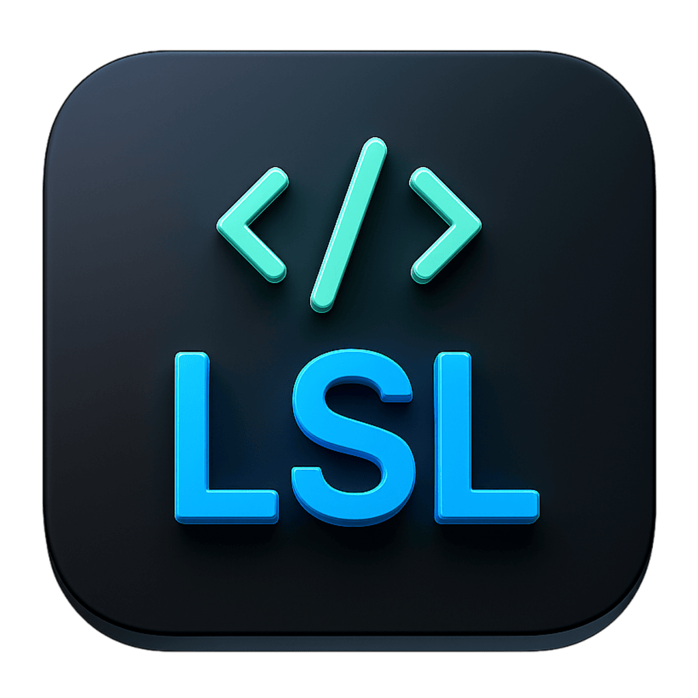

# LuxSimpleLang IDE

A modern, user-friendly IDE for the LuxSimpleLang programming language, built with PyQt6.



## Features

- 🎨 Modern, customizable interface with Dark and Light themes
- 📝 Syntax highlighting for LuxSimpleLang
- 📋 Code editing with line numbers
- 🔄 Undo/Redo functionality
- 💾 File operations (Open, Save, Save As)
- 🌍 Multi-language support (English, Czech)
- 📚 Built-in user guide and documentation
- 🎯 Code execution environment
- 📏 Adjustable font size
- 🖥️ Fullscreen mode support
- 🚀 Splash screen

## Installation

1. Ensure you have Python 3.6+ installed
2. Install required dependencies:
```bash
pip install PyQt6
```

3. Clone the repository:
```bash
git clone https://github.com/luxopes/LuxSimpleLang.git
cd LuxSimpleLang
```

4. Run the IDE:
```bash
python main.py
```

## Usage

1. Write or load your LuxSimpleLang code in the editor
2. Use the "Run code" button to execute your program
3. View the output in the bottom panel
4. Save your work using Ctrl+S or File -> Save

## Keyboard Shortcuts

- `Ctrl+O` - Open file
- `Ctrl+S` - Save file
- `Ctrl+Z` - Undo
- `Ctrl+Y` - Redo
- `F11` - Toggle fullscreen
- `ESC` - Exit fullscreen

## Language Support

The IDE supports both English and Czech languages. You can switch between languages in the Language menu.

## Documentation

- Built-in guide available in Help -> User Guide
- Online manual available at [https://lsl.netlify.app/](https://lsl.netlify.app/)

## Version

Current version: 0.0.4 Testing

## License

This project is licensed under the Lux Development License - see the [LICENSE.md](LICENSE.md) file for details.

Key points:
- ✔️ Free for private use and modification
- ✔️ Can be used as a learning resource
- ❌ Public derivative works are not permitted
- ❌ Commercial use requires permission

## Contact

Email: bambiliarda@gmail.com

## Contributing

Contributions are welcome! Please feel free to submit a Pull Request.
